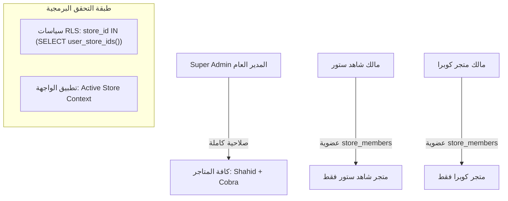

# تقرير التدقيق المعماري وعزل المتاجر (Multi-Tenant Readiness & Tenant Isolation Audit)

**تاريخ التدقيق:** 8 سبتمبر 2026  
**الملف:** `docs/multi-tenant-readiness-audit.md`  
**الهدف:** فحص وتحليل معماري شامل للتأكد من جاهزية النظام الحالي لدعم تعدد المتاجر (Multi-Tenant) بشكل حقيقي ومحكم، ورصد كافة الاعتماديات الثابتة (Hardcoded References) ونقاط الخطر المحتملة قبل إضافة متجر **Cobra**، لضمان عدم تسريب البيانات أو التأثير على متجر **Shahid Store**.

---

## 1. المشكلة الأساسية وتحليل القيمة الافتراضية لـ Store ID

### 1.1 أين يتم استخدام معرّف المتجر الحالي؟
المعرّف الخاص بمتجر شاهد ستور هو:
`7a3c8e14-6b92-4f8e-9d21-4c5e7b8a9f01`

يظهر هذا المعرف حالياً في ثلاثة مستويات رئيسية:
1. **في قاعدة البيانات كـ `DEFAULT`:**
   * في أعمدة `store_id` لجداول: `products`, `categories`, `coupons`, `orders`, `inventory_accounts`, `store_settings`.
   * في دالة التريجر `public.trg_ensure_store_id()` التي تقوم بتعويض أي قيمة `NULL` للمعرف بالرمز: `'7a3c8e14-6b92-4f8e-9d21-4c5e7b8a9f01'`.
2. **في متغيرات البيئة وإعدادات النشر (Cloudflare Workers):**
   * في [wrangler.jsonc](file:///c:/Users/Digitaneo/Desktop/dev/shahid/shahid-store-main/wrangler.jsonc):
     `"STORE_ID": "7a3c8e14-6b92-4f8e-9d21-4c5e7b8a9f01"`
   * في [.env](file:///c:/Users/Digitaneo/Desktop/dev/shahid/shahid-store-main/.env):
     `VITE_STORE_ID=7a3c8e14-6b92-4f8e-9d21-4c5e7b8a9f01`
3. **في كود المتجر الحالي:**
   * في [store-config.ts](file:///c:/Users/Digitaneo/Desktop/dev/shahid/shahid-store-main/src/lib/store-config.ts) كقيمة احتياطية `DEFAULT_SHAHID_STORE_ID`.

### 1.2 هل يمكن أن يؤدي ذلك إلى إضافة بيانات متجر Cobra داخل متجر شاهد؟
**نعم، إذا لم يتم استيفاء المعرف صراحة في عمليات الإدخال (INSERT):**
* إذا أرسل تطبيق متجر Cobra عملية إدخال منتج أو طلب شراء أو تصنيف وكانت قيمة `store_id` مفقودة أو `null`، فإن التريجر `trg_ensure_store_id` والقيمة الافتراضية في الجدول ستضع معرف متجر شاهد ستور تلقائياً!
* **النتيجة:** سيتم تسجيل منتج Cobra أو طلب Cobra داخل متجر شاهد ستور عن طريق الخطأ.

### 1.3 ما هي الطريقة الصحيحة لاستبداله بنظام ديناميكي دون كسر النظام الحالي؟
1. **في تطبيق متجر Cobra (المشروع المنفصل):**
   * يتم تمرير الـ `STORE_ID` الخاص بكوبرا حصراً عبر متغيرات البيئة المستقلة لـ Worker:
     `wrangler.jsonc` الخاص بكوبرا يحدد: `"STORE_ID": "c0b7a001-..."`.
   * جعل جميع عمليات الإدخال (Insert) والتعديل (Update) والاستعلام (Select) تتضمن صراحة:
     `.eq("store_id", STORE_ID)` و `{ store_id: STORE_ID }`.
2. **في قاعدة البيانات (Database Safety):**
   * الإبقاء على القيمة الافتراضية لمتجر شاهد ستور حالياً لضمان عدم توقف أي عملية في شاهد ستور، ولكن:
   * **إلزام واجهة متجر Cobra بتمرير المعرف الخاص بها دائماً** في كل طلب (Payload).
   * تعديل التريجر لاحقاً ليرفض العمليات الخالية من `store_id` فقط للمتاجر الجديدة، أو التحقق من النطاق (Domain/Header).

---

## 2. مصفوفة تدقيق عزل قاعدة البيانات (Database Isolation Audit)

| الجدول (Table) | يحتوي `store_id`؟ | المفتاح الخارجي (FK) | القيمة الافتراضية (Default) | وضع الـ RLS الحالي | Multi-Tenant Ready | التقييم وملاحظات الأمان |
| :--- | :---: | :---: | :---: | :---: | :---: | :--- |
| **`stores`** | ✅ هو الجدول الأساسي | - | مولد تلقائي UUID | مفعل للمدراء | **جاهز بالكامل (READY)** | يحتوي على `id, slug, name_ar, domain, owner_id`. |
| **`store_members`** | ✅ نعم | `stores(id)` | - | مفعل للأعضاء | **جاهز بالكامل (READY)** | يربط المستخدم بالمتجر ودوره (`owner, admin, member`). |
| **`products`** | ✅ نعم | `stores(id)` | `'7a3c8e14...'` | مفعل (Admin Manage) | **يحتاج فلتر استعلام (CHANGES)** | الاستعلام العام للكتالوج لا يفلتر بـ `store_id` بعد. |
| **`categories`** | ✅ نعم | `stores(id)` | `'7a3c8e14...'` | مفعل (Admin Manage) | **يحتاج فلتر استعلام (CHANGES)** | استعلام التصنيفات لا يفلتر بـ `store_id`. |
| **`coupons`** | ✅ نعم | `stores(id)` | `'7a3c8e14...'` | مفعل (Admin Manage) | **يحتاج فلتر استعلام (CHANGES)** | فحص الكوبون في Checkout يجب أن يطابق `store_id`. |
| **`orders`** | ✅ نعم | `stores(id)` | `'7a3c8e14...'` | مفعل (Admin Manage) | **يحتاج فلتر إدخال (CHANGES)** | Checkout لا يمرر `store_id` في حمولة الإدخال حالياً. |
| **`inventory_accounts`** | ✅ نعم | `stores(id)` | `'7a3c8e14...'` | مفعل (Admin Manage) | **جاهز (READY)** | معزول بالكامل بـ `store_id`. |
| **`store_settings`** | ✅ نعم | `stores(id)` | `'7a3c8e14...'` | مفعل | **يحتاج فلتر استعلام (CHANGES)** | الإعدادات يجب أن تقرأ سجل المتجر المحدد فقط. |
| **`activation_steps`** | ❌ لا يوجد | - | - | غير معزول بالـ ID | **يحتاج إضافة store_id** | صور الشروحات معزولة في Storage فقط عبر البادئة. |
| **`profiles`** | ❌ عام للنظام | `auth.users(id)` | - | مفعل للمستخدم نفسه | **جاهز معمارياً (READY)** | المستخدم عالمي عبر المنصة وطلباته معزولة بـ `orders.store_id`. |
| **`admin_users`** | ❌ جدول إداري عام | `auth.users(id)` | - | مفعل للـ Admins | **يحتاج ربط أو استخدام store_members** | يحدد رتبة الإدارة العامة، ويجب ربطه بـ `store_members`. |

---

## 3. قائمة المراجع الثابتة في الكود (Hardcoded Store References)

| الملف (File) | السطر / الدالة | السلوك الحالي (Current Behavior) | مستوى الخطورة (Risk) | التعديل المطلوب (Required Change) |
| :--- | :--- | :--- | :---: | :--- |
| **`src/lib/store-config.ts`** | السطر 6: `DEFAULT_SHAHID_STORE_ID` | يعود لمعرف شاهد ستور كبديل إذا خلا المتغير | منخفض | في مشروع Cobra، يتم تغيير القيمة الافتراضية لمعرف متجر كوبرا. |
| **`src/lib/queries.ts`** | السطر 60: `fetchProducts()` | يستعلم `products` بشرط `is_active=true` فقط | **عالي جداً** | إضافة `.eq("store_id", STORE_ID)` لمنع ظهور منتجات Cobra في متجر Shahid. |
| **`src/lib/queries.ts`** | السطر 74: `fetchBestsellers()` | يستعلم الباقات الأكثر مبيعاً بدون فلتر متجر | **عالي** | إضافة `.eq("store_id", STORE_ID)`. |
| **`src/lib/queries.ts`** | السطر 86: `fetchProductsByCategory()` | يستعلم التصنيف والمنتجات بدون فلتر متجر | **عالي** | إضافة `.eq("store_id", STORE_ID)`. |
| **`src/routes/checkout.$slug.tsx`** | السطر 571: `orders.insert(payload)` | ينشئ الطلب دون إرسال `store_id` صراحة | **عالي جداً** | إضافة `store_id: STORE_ID` داخل الـ `payload` قبل الإرسال. |
| **`src/lib/admin-products.ts`** | السطر 58: `fetchAdminProducts()` | يستعلم منتجات الإدارة دون تمرير فلتر متجر | **متوسط** | إضافة `.eq("store_id", STORE_ID)` لضمان عزل لوحة تحكم كل متجر. |
| **`src/lib/admin-orders.ts`** | السطر 160: `fetchAdminOrders()` | يستعلم الطلبات بدون فلتر `store_id` | **عالي** | إضافة `.eq("store_id", STORE_ID)` لمنع تداخل الطلبات بين المدراء. |
| **`src/lib/admin-settings.ts`** | السطر 72: `fetchAdminSettings()` | يستعلم الإعدادات والعدّادات لجميع المنتجات والطلبات | **متوسط** | إضافة فلترة بـ `store_id: STORE_ID`. |
| **`src/lib/admin-customers.ts`** | السطر 57: `fetchAdminCustomers()` | يستعلم العملاء من جدول الطلبات دون فلتر متجر | **متوسط** | حصر العملاء بطلبات المتجر المحدد `.eq("store_id", STORE_ID)`. |
| **`09_fix_product_rls_policy.sql`** | السطر 35: `trg_ensure_store_id` | يضع معرف شاهد إذا كان `NEW.store_id IS NULL` | **متوسط** | حماية Cobra تقتضي عدم إرسال قيم فارغة أبداً من الواجهة. |

---

## 4. تدقيق عزل الواجهات والـ APIs (API Isolation Audit)

| نطاق البيانات (Domain) | كيف يتحدد `store_id` حالياً؟ | هل يوجد خطر تسريب بيانات (Data Leakage)؟ | هل يوجد فلتر `store_id` صريح؟ | الإجراء الواجب لتأمين العزل الكامل |
| :--- | :--- | :---: | :---: | :--- |
| **المنتجات (Products)** | ضمنياً عبر RLS فقط | **نعم (في Storefront)** | ❌ لا يوجد في `queries.ts` | إلزام جميع استعلامات الـ Storefront بـ `.eq("store_id", STORE_ID)`. |
| **التصنيفات (Categories)** | ضمنياً عبر RLS فقط | **نعم** | ❌ لا يوجد | إضافة `.eq("store_id", STORE_ID)` عند جلب الأقسام. |
| **الطلبات (Orders)** | يعتمد على DEFAULT في الإدخال | **نعم** | ❌ لا يمرر في checkout | إرسال `store_id` صراحة عند إنشاء الطلب، وفلترة استعلامات الإدارة بـ `store_id`. |
| **الكوبونات (Coupons)** | يتم الإدخال بـ `STORE_ID` | **منخفض** | ⚠️ الفحص يحتاج تدقيق | التأكد من أن دالة التحقق من الكوبون تفحص المتجر الحالي فقط. |
| **المخزون (Inventory)** | عبر RLS وجدول `inventory_accounts` | **منخفض** | ⚠️ يعتمد على اسم الجدول | تصحيح استعلام `subscription_inventory` إلى `inventory_accounts` مع ربط المتجر. |
| **الإعدادات (Settings)** | عام عبر `store_settings` | **نعم** | ❌ لا يوجد | ربط كل سجل في `store_settings` بـ `store_id` المطابق. |

---

## 5. عزل لوحة التحكم الإدارية (Admin Panel Isolation)

### 5.1 الوضع الحالي
* جدول `admin_users` الحالي هو جدول عام على مستوى المنصة (يحتوي على حسابات المدراء ولا يحتوي على عمود `store_id`).
* جدول `store_members` هو الجدول المعماري المخصص للربط (`store_id, user_id, role`).
* حالياً، كلا الحسابين الإداريين مسجلان كمالكين لمتجر شاهد ستور في `store_members`.

### 5.2 التصميم المعماري المقترح لعزل لوحة التحكم
لتمكين مدير متجر Cobra من إدارة متجر Cobra فقط دون رؤية متجر شاهد، مع تمكين المدير العام من رؤية الجميع:



#### الهيكلية المقترحة:
1. **المدير العام (Super Admin):**
   * يملك دور `super_admin` في `admin_users`.
   * يستطيع التبديل بين المتاجر عبر قائمة منسدلة (Active Store Selector) في لوحة التحكم، أو إدارة متجر معين بناءً على الـ Worker الذي يدخل منه.
2. **مالك متجر Cobra (Store Owner):**
   * يسجل في `store_members` بـ `store_id = cobra_store_id` ودور `owner`.
   * سياسات الـ RLS في Supabase تحظر عليه تلقائياً قراءة أو تعديل أي سجل ينتمي لشاهد ستور.
3. **مدير المتجر (Store Manager):**
   * يملك دور `admin` أو `staff` داخل `store_members` لنفس المتجر فقط.

---

## 6. عزل واجهة المتجر للزوار (Storefront Isolation Strategy)

### المقارنة بين الخيارات:

#### الخيار الأول: التحديد عبر النطاق (Request Domain Resolver)
```text
Request: https://shahid-store.com  ──► Worker A ──► STORE_ID: 7a3c8e14...
Request: https://cobra-store.com   ──► Worker B ──► STORE_ID: c0b7a001...
```
* **المميزات:**
  * كل متجر يملك Worker مستقلاً ونطاقاً مخصصاً (Custom Domain).
  * المتغير `STORE_ID` محقون على مستوى خادم الـ Worker (عبر `wrangler.jsonc`) ولا يمكن للزائر التلاعب به.
  * لا يحتاج الزائر إلى رؤية بادئة في الرابط (مثل `/stores/cobra`).
  * سرعة استجابة فائقة بفضل الكاش الإقليمي على Cloudflare Edge.

#### الخيار الثاني: التحديد عبر مسار الرابط (URL Path Slug Resolver)
```text
Request: https://platform.com/stores/cobra  ──► Slug Resolver ──► store_id
```
* **العيوب:**
  * غير مناسب للمتاجر الاحترافية المستقلة ذات العلامات التجارية الخاصة.
  * يعقد توجيه الروابط ومحركات البحث (SEO).

#### 💡 التوصية المعتمدة:
**الاعتماد على الخيار الأول (Domain & Worker Environment Isolation):**
* متجر شاهد يعمل على Worker خاص به بمعرف `STORE_ID: 7a3c8e14-6b92-4f8e-9d21-4c5e7b8a9f01`.
* متجر كوبرا يعمل على Worker مستقل تماماً بمعرف `STORE_ID: c0b7a001-6b92-4f8e-9d21-4c5e7b8a9f02`.
* كلاهما يتصل بنفس قاعدة بيانات Supabase المشتركة، ولكن كل خادم Worker يفلتر عملياته حصراً بـ `store_id` الخاص به.

---

## 7. عزل التخزين والملفات (Storage Isolation)

### 7.1 البنية الهندسية
تخزين الصور معزول بالكامل داخل باكت `product-images`:
```text
product-images/
├── 7a3c8e14-6b92-4f8e-9d21-4c5e7b8a9f01/   <-- متجر شاهد ستور (14 ملفاً نظيفاً)
│   ├── falcon-card.webp
│   └── hulk-card.webp
└── c0b7a001-6b92-4f8e-9d21-4c5e7b8a9f02/   <-- متجر كوبرا (مجلد مستقل بالكامل)
    ├── cobra-ultra.webp
    └── cobra-vip.webp
```

### 7.2 الحماية وسياسات الأمان (Storage RLS Policies)
تم تفعيل سياسة العزل في [08_multi_tenant_stores.sql](file:///c:/Users/Digitaneo/Desktop/dev/shahid/supabase_sql_snippets/08_multi_tenant_stores.sql):
```sql
CREATE POLICY "storage_store_isolation_manage" ON storage.objects
  FOR ALL TO authenticated
  USING (
    public.is_admin(auth.uid())
    OR EXISTS (
      SELECT 1 FROM public.store_members sm
      WHERE sm.user_id = auth.uid()
        AND storage.objects.name LIKE sm.store_id::text || '/%'
    )
  )
```
* **الحماية:** أي مدير ينتمي لمتجر Cobra يستحيل عليه رفع أو حذف أو تعديل أي ملف يبدأ بمسار متجر شاهد ستور، لأن الشرط يلزم بأن يبدأ المسار بـ `sm.store_id::text || '/%'`.
* **العرض العام:** روابط الصور العامة (Public URLs) تعمل مباشرة لأن الباكت Public دون الحاجة لسياسة SELECT واسعة تسبب تحذيرات أمنية.

---

## 8. عزل حسابات العملاء والمصادقة (Auth & Customer Isolation)

### النموذج المعماري المعتمد
تجنب تكرار الحسابات عند قيام العميل بالشراء من متجري شاهد وكوبرا:

```text
auth.users (سجل المستخدم الفريد بالبريد/الجوال)
     │
     ▼
public.profiles (الملف الشخصي الموحد)
     │
     ├────────────────────────┬────────────────────────┐
     ▼                        ▼                        ▼
orders (متجر شاهد)       orders (متجر كوبرا)      orders (متجر مستقبلي)
store_id: 7a3c8e14...    store_id: c0b7a001...    store_id: ...
```

* **المزايا:**
  1. العميل يستطيع تسجيل الدخول بنفس البريد وكلمة المرور في أي من المتاجر التابعة للمنصة.
  2. في صفحة "طلباتي" في متجر شاهد، لا يرى إلا طلبات متجر شاهد (`WHERE store_id = SHAHID_STORE_ID`).
  3. في صفحة "طلباتي" في متجر كوبرا، لا يرى إلا طلبات متجر كوبرا (`WHERE store_id = COBRA_STORE_ID`).
  4. خصوصية تامة وعزل بدون تعقيد تسجيل حسابات متعددة لنفس الشخص.

---

## 9. خطة الاختبار المعزول الآمن (Safe Tenant Isolation Test Plan)

**سيناريو الاختبار المستقبلي المقترح (دون تنفيذ الآن):**
1. **إنشاء معرف تجريبي افتراضي:** `test-tenant-9999-0000-0000-000000000001`.
2. **إضافة منتج تجريبي:** إدخال منتج باسم "منتج تجريبي معزول" بـ `store_id = test-tenant-...`.
3. **التحقق السلبي (Negative Verification):**
   * فتح متجر شاهد ستور ومحاولة البحث عن المنتج التجريبي أو طلبه عبر الـ API.
   * **النتيجة المتوقعة:** لا يظهر نهائياً في الواجهة أو الكتالوج.
4. **التحقق من التخزين (Storage Test):**
   * محاولة رفع ملف باسم `test-tenant-.../test.jpg` بحساب لا يملك صلاحية عليه.
   * **النتيجة المتوقعة:** رفض العملية بواسطة RLS.
5. **التنظيف التلقائي الفوري (Automated Purge):**
   * حذف السجل التجريبي وملف التخزين للتأكد من نظافة القاعدة.

---

## 10. جدول أمان التعديلات المطلوبة (Migration Safety Matrix)

| التغيير المطلوب | سببه المعماري | الجداول / الملفات المتأثرة | مستوى الخطورة | إمكانية التراجع | هل يؤثر على متجر شاهد؟ | خطة الاختبار المسبق |
| :--- | :--- | :--- | :---: | :---: | :---: | :--- |
| **1. فلترة استعلامات المنتجات بـ `store_id`** | منع اختلاط الباقات في Storefront | `queries.ts` | منخفض جداً | نعم (سطر كود) | ❌ لا يؤثر (سيطلب فقط منتجات شاهد) | تشغيل المتجر محلياً والتحقق من ظهور 13 منتجاً لشاهد |
| **2. إرسال `store_id` في حمولة Checkout** | تسجيل الطلب في المتجر الصحيح | `checkout.$slug.tsx` | منخفض جداً | نعم (إضافة حقل) | ❌ لا يؤثر (يرسل معرف شاهد للمتجر الحالي) | عمل طلب تجريبي في الساندبوكس |
| **3. فلترة طلبات لوحة التحكم** | عزل لوحة تحكم كل متجر | `admin-orders.ts` | منخفض | نعم | ❌ لا يؤثر | التأكد من استمرار ظهور طلب شاهد الحالي |
| **4. إضافة سجل متجر كوبرا في `stores`** | تسجيل المتجر الجديد في النظام | جدول `stores` | معدوم (إضافة فقط) | نعم (`DELETE`) | ❌ لا يؤثر نهائياً | فحص استقرار جدول stores |
| **5. إنشاء مجلد تخزين متجر كوبرا** | عزل وسائط كوبرا | باكت `product-images` | معدوم | نعم | ❌ لا يؤثر | التأكد من بقاء مجلد شاهد دون مساس |

---

## 11. القرار والنتيجة النهائية (Final Decision)

### النتيجة المعمارية:
## 🟡 **الحالة الثانية: READY WITH CHANGES (جاهز مع تعديلات محددة)**

النظام الحالي يمتلك البنية التحتية الأساسية الممتازة للعزل (جدول `stores`, جدول `store_members`, وعمود `store_id` في الجداول الحيوية، وسياسات RLS)، ولكنه **يحتاج إلى 4 تعديلات برمجية طفيفة قبل إطلاق متجر Cobra** لضمان عدم حدوث أي تسريب للبيانات.

---

### الإجابة الصريحة والمباشرة على الأسئلة الخمسة:

#### 1. هل `store_id` الحالي ديناميكي أم Hardcoded؟
* **في الواجهة وتطبيقات الإدخال:** شبه ديناميكي (يقرأ من متغير البيئة `VITE_STORE_ID` مع وجود Fallback ثابت).
* **في استعلامات القراءة (Select):** غير مفلتر في واجهة المتجر (يعتمد على افتراض وجود متجر واحد فقط في الجدول).
* **في قاعدة البيانات:** يوجد قيمة `DEFAULT` ثابتة وتريجر يعوض القيم الفارغة بمعرف متجر شاهد.

#### 2. هل يمكن تشغيل متجرين فعلياً الآن؟
* **لا ننصح بتشغيلهما في هذه اللحظة بالذات**؛ لأنه بمجرد إدخال منتج لمتجر Cobra، سيظهر المنتج فوراً داخل متجر شاهد ستور للمشترين لأن دالة `fetchProducts()` في شاهد ستور لا تضع شرط `.eq("store_id", STORE_ID)`.

#### 3. أين توجد نقاط الخطر الدقيقة؟
1. نقطة الخطر الأولى: دالة `fetchProducts()` في `src/lib/queries.ts` (خطر خلط المنتجات في الصفحة الرئيسية).
2. نقطة الخطر الثانية: إنشاء الطلب في `src/routes/checkout.$slug.tsx` (خطر تسجيل طلب كوبرا داخل شاهد إذا لم يُمرر المعرف).
3. نقطة الخطر الثالثة: تريجر قاعدة البيانات `trg_ensure_store_id` (يعيد تعيين أي قيمة فارغة لشاهد ستور).

#### 4. ما هو أقل عدد من التعديلات المطلوبة للوصول إلى الجاهزية التامة؟
**4 تعديلات برمجية بسيطة فقط لا تستغرق دقائق:**
1. إضافة `.eq("store_id", STORE_ID)` في `queries.ts` لمتجر شاهد.
2. إضافة `store_id: STORE_ID` في حمولة `orders.insert` داخل `checkout.$slug.tsx`.
3. إضافة `.eq("store_id", STORE_ID)` في استعلامات لوحة التحكم `admin-orders.ts` و `admin-products.ts`.
4. ضبط مشروع متجر Cobra الجديد بمتغير البيئة الخاص به `VITE_STORE_ID = cobra_uuid`.

#### 5. ما هي الخطوة التالية المقترحة؟
تطبيق التعديلات الوقائية الأربعة أولاً على كود متجر شاهد ستور للتأكد من حمايته، ثم الانتقال فوراً لإنشاء متجر Cobra المعزول بأمان مطلق.
